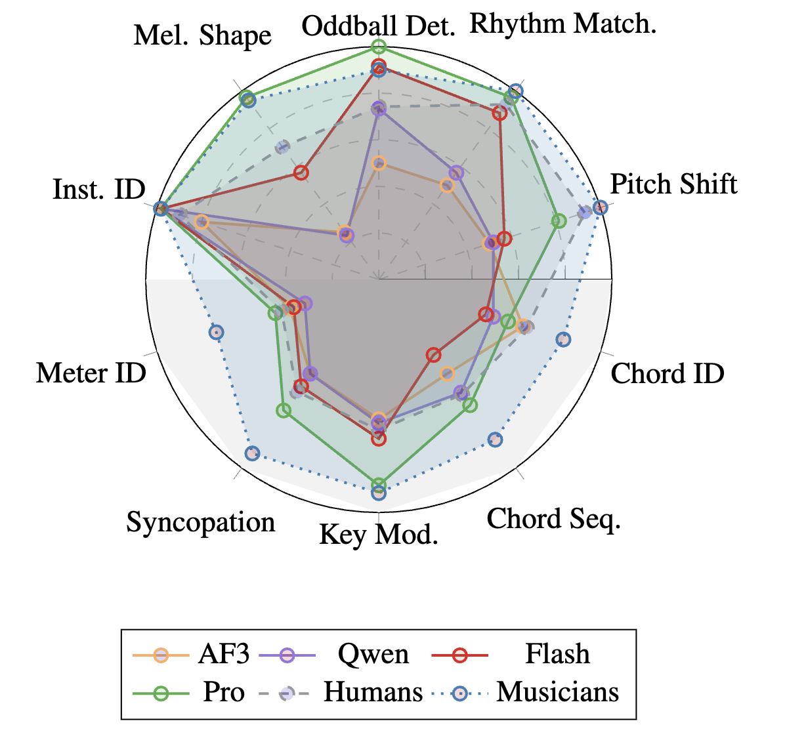
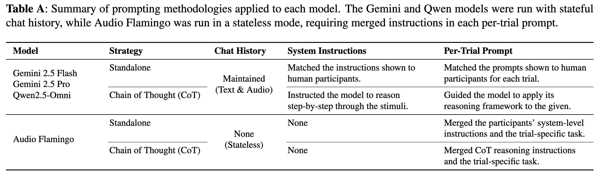
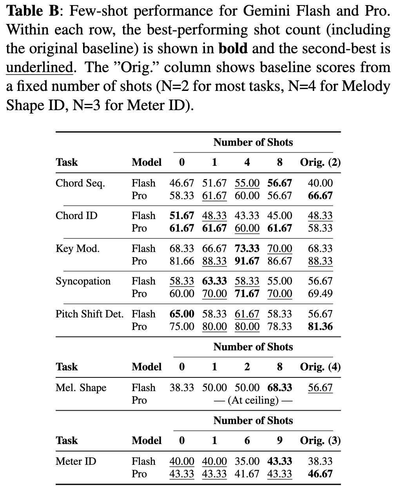

# THE MUSE BENCHMARK 🎵🎸🎹🥁
### Probing Music Perception and Auditory Relational Reasoning in Audio LLMs

This repository contains the official code, stimuli, and results for the paper **"The MUSE Benchmark: Probing Music Perception and Auditory Relational Reasoning in Audio LLMs"** (submitted to ICASSP 2025). We provide a novel, open-source benchmark and a comprehensive evaluation of SOTA multimodal models, grounded by a large-scale human study.

[Link to stimuli table](https://airtable.com/appQCPXVEeadwacMP/shrHV0OjuwxYBzJ78) | [Link to Human Data on OSF](osf.io/pvrd7/?view_only=3c3ac357272e43a08a201698fe6bd9c9)

---

## Overview

Recent SOTA multimodal Large Language Models (LLMs) have demonstrated impressive capabilities in audio understanding. However, their evaluation on predominantly classification-based tasks may obscure fundamental weaknesses in **abstract relational reasoning**—the ability to understand relationships between auditory events, such as recognizing a melody's contour or its identity across different keys.

The **Music Understanding and Structural Evaluation (MUSE) Benchmark** was created to address this evaluation gap. It consists of 10 tasks and ~200 original musical stimuli designed to systematically probe for these core, human-like perceptual abilities.

## Key Findings

Our evaluation of four SOTA models (Gemini Pro, Gemini Flash, Qwen2.5-Omni, and Audio Flamingo 3) against a large human baseline (N=200) revealed:

1.  **A Wide Variance in SOTA Capabilities:** While Gemini Pro performs strongly on basic perceptual tasks, often matching non-expert human accuracy, other models exhibit critical failures.
2.  **Critical Model Failures:** Qwen performs **below chance** on Contour Identification, and Audio Flamingo 3 performs **at or near chance** on the majority of tasks, indicating a profound lack of core perceptual competence.
3.  **A Persistent Gap with Human Experts:** On tasks requiring music-theoretic knowledge (e.g., Chord Progression Matching, Key Modulation), all models were significantly outperformed by expert human listeners.
4.  **Chain-of-Thought (CoT) is Unreliable:** CoT prompting provided inconsistent and often detrimental results, suggesting that explicit textual reasoning is not a robust solution for enhancing non-linguistic perception in these models.
5.  **In-Context Learning is Not Human-Like Learning:** Unlike humans, who consistently improve with musical training, providing models with more in-context examples (shots) did not lead to reliable performance gains on abstract tasks.


*Fig. 1: A summary of SOTA model performance on the MUSE benchmark, contrasted with our human baseline (dashed/dotted lines).*

---

## The MUSE Benchmark Tasks

The benchmark is divided into two tiers, with all tasks requiring a binary or multi-class decision. See the paper or the task descriptions at the end of this README for full details.

#### Beginner Tasks: Core Perception & Invariance
*   **Instrument ID:** Identify an instrument based on its timbre.
*   **Melody Shape ID:** Identify a melody's overall shape (e.g., ascending/descending).
*   **Oddball Detection:** Detect out-of-key notes within a melody.
*   **Rhythm Matching:** Determine if two rhythmic sequences are identical.
*   **Pitch Shift Detection:** Detect if a melody has been pitch-shifted.

#### Advanced Tasks: Music-Theoretic Skills
*   **Chord Quality ID:** Identify a chord's quality (major/minor).
*   **Key Modulation Detection:** Detect if a change of key occurs.
*   **Chord Sequence Matching:** Determine if two chord sequences match functionally.
*   **Syncopation Comparison:** Determine which of two rhythms is more syncopated.
*   **Meter ID:** Identify the underlying grouping of beats.

---

## Reproducing Our Results

This repository provides all the necessary scripts to reproduce the results from our paper.

## Prompting methodologies & per‑trial prompt design (Table A)



---

## Few-shot performance summary (Table B)

We sweep the number of in‑context examples (shots) per task, reporting the **best** and **second‑best** shot counts per row. The **“Orig.”** column shows baseline scores from the original fixed‑shot setup (N=2 for most tasks; N=4 for Melody Shape ID; N=3 for Meter ID).



---

## Repository structure

```
---

## Repository layout

AF3/                     # Audio Flamingo (AF3) runners — stateless prompting with merged instructions
Gemini/                  # Gemini 2.5 Pro / Flash runners — stateful chat; SYSINST and CoT modes
Qwen2.5-Omni/            # Qwen2.5‑Omni runners — stateful chat; CoT-aligned prompts
Gemini_Qwen_AF_logs/     # Log summarizers, accuracy aggregation utilities
stimuli/                 # Audio WAV stimuli (canonical root expected by all runners)
fig1_muse_radar.png     
tableA.png             
tableB.png
README.md
.gitignore               

> Keep the **stimuli/** root and runner filenames unchanged to preserve the evaluation pipeline and parsers.
```

> **Stimulus root**: Runners assume `stimuli/` as the canonical root; keep this path intact.

---

## Reproducible runs (framework conventions)

All runners share the same **grid**, **logging**, **parsing**, and **evaluation** conventions:

- **Modes**: `SYSINST` (plain system instructions) vs `COT` (reasoning).  
- **Stateful chat**: Gemini/Qwen maintain **full audio + text history** across trials in a run.  
- **Stimulus groups**: `GroupA` / `GroupB` fixed splits; shuffling per `seed`.  
- **Canonical answers**: Exact strings + regex parsers; we score the **last** valid answer line.  
- **Logging**: one log per run with config, stimulus IDs/paths, full model response, parsed final answer & evaluation, and total accuracy.

**Log filename pattern (exact):**
```
{taskname}_{modelTag}_CHAT_{mode}_{group}_seed{seed}.log
```
Example:
```
rhythm_matching_G25Pro_CHAT_COT_GroupA_seed1.log
```

---

## How to run (examples)

```bash
python runners/gemini/chord_quality_Gemini_runner.py
python runners/gemini/progression_matching_Gemini_runner.py
python runners/qwen/rhythm_matching_Qwen2.5-Omni_runner.py
```

Logs will appear in your working directory following the naming convention above.

---

## Detailed Task Descriptions

### Beginner
The beginner questions in the benchmark consist of five core tasks that reflect fundamental aspects of human music perception and basic auditory perception (Dowling & Fujitani, 1971; Dowling, 1978; Deutsch, 1969 & 1972; Bharucha & Krumhansl, 1983; Trainor & Corrigall, 2010; Krumhansl & Cuddy, 2010; Halpern & Bartlett, 2010; Tervaniemi, 2003; Huron, 1996; Goldstein et al., 2025; Baldé et al., 2025). 

**Transposition Detection**  
In this task, participants listen to two musical audio clips where the first excerpt is the anchor, and the second is either the same melody transposed to a different key, or a different melody. After listening, they must decide whether the two audio clips represent the same melody or not. Stimuli are short excerpts played on an electric guitar or a piano, and are varied across tempo, key, meter, and melody length (see Supplementary Table 1 for full stimuli details). Testing melody recognition across transpositions assesses the model's ability to recognize melodies despite changes in absolute pitch and timbre. Human listeners rely on relative pitch and melodic contour (the pattern of rising and falling pitches) for melody recognition, making it robust to changes in key and instrumentation (Dowling & Fujitani, 1971; Dowling, 1978; Deutsch, 1969 & 1972). By testing this, we can evaluate whether the model exhibits similar perceptual invariance.

**Rhythm Matching**  
In this task, participants listen to two musical audio clips of drums played at the same tempo where the first clip is the anchor, and the second is either the same exact rhythmic sequence (or rather, the same audio file as the anchor), or a different drum beat. After listening, they must decide whether the two audio clips represent the same exact drum beat or not. Stimuli are short excerpts played on a drum set, and are varied in meter (see Supplementary Table 2 for full stimuli details). Assessing rhythmic perception examines the model's ability to process rhythmic sequences and detect changes in rhythmic structure while maintaining the same tempo. Humans perceive rhythmic regularity and can recognize patterns despite tempo variations, engaging both auditory and motor systems in the brain (Thaut et al., 2014; Grahn & Brett, 2007; Toiviainen et al., 2020).

**Oddball Detection**  
In this task, participants listen to two musical audio clips where the first clip is the anchor, and the second is either the same exact melody (or rather, the same audio file as the anchor), or a similar melody that is slightly altered so that one of the pitches present is shifted to be an oddball, or an out-of-key deviant. After listening, they must decide whether the two audio clips represent the same exact melody or if one of them contains an oddball, which is defined before asking the question. Stimuli were recorded using an electric guitar or a piano, and are varied across tempo, key, meter, and melody length (see Supplementary Table 3 for full stimuli details). This task evaluates the model's sensitivity to tonal hierarchies and its ability to detect deviations from expected melodic patterns. Human listeners are adept at detecting out-of-key notes based on their understanding of harmonic structure and tonal context (Krumhansl & Shepard, 1979; Bharucha & Krumhansl, 1983; Tervaniemi, 2003). Testing this aspect assesses whether the model's encoding of melodic structure aligns with human perception.

**Instrument Identification**  
In this task, participants listen to one musical audio clip. After listening, they must identify whether the excerpt was a piano, guitar, bass, or drums. Stimuli are varied across instruments (see Supplementary Table 4 for full stimuli details). Testing instrument identification evaluates the model's ability to recognize instruments based on their timbral qualities. Both children and adults can accurately identify instruments by processing specific acoustic cues such as resonance and excitation patterns that make up the unique timbres of each instrument (Schellenberg et al., 2005; Giordano & McAdams, 2010; McAdams et al., 2013). This assesses whether the model can extract and utilize similar timbral information.

**Contour Identification**  
In this task, participants listen to one musical audio clip containing a scale or arpeggio played on the piano, guitar, or bass. After listening, they must identify the contour or shape of the musical pattern they heard, choosing between arch (ascending and then descending), inverted arch (descending and then ascending), ascending, or descending. Stimuli are varied across instruments and keys (see Supplementary Table 5 for full stimuli details). Evaluating contour recognition in melodies tests the model's ability to recognize melodies based on their overall shape (the pattern of rising and falling pitches), even with slight pitch alterations (Huron, 1996; Goldstein et al., 2025). Human listeners can identify melodies based on contour even when specific pitch values are altered slightly or transposed to a different key (Dowling & Fujitani, 1971). This assesses the model's alignment with core aspects of melodic perception.

### Advanced
The advanced questions in the benchmark comprise five tasks that reflect skills typically requiring years of music theory and ear-training—meter identification, key modulation detection, syncopation detection, chord progression matching, and chord quality identification. Unlike the Beginner set, these tasks demand explicit knowledge of music-theoretic constructs and abstract relational reasoning about hierarchical pitch/rhythm structure (Krumhansl, 1990; Temperley, 2001).

**Meter Identification**  
In this task, participants listen to a single musical excerpt and must identify its underlying grouping of beats. Stimuli are short music excerpts covering groups of 3 (3/4 and 6/8), groups of 4 (4/4), and groups of 5 (5/4) and are varied across tempo and instrumentation. Successful meter identification requires listeners to perceive the repeating cycle of strong and weak beats (i.e., the meter), rather than merely the surface pattern. Music cognition research defines meter as the cognitive grouping of regular sound sequences (Kondoh et al., 2021). Meter perception can arise from bottom‑up acoustic cues (such as accent patterns) or from top‑down attentional processes, and musicians perceive meter more accurately and stably than non‑musicians (Kondoh et al., 2021). Neuroimaging studies further show that meter, pattern and tempo are processed by partly distinct neural systems, with meter specifically representing repeating cycles of strong and weak beats (Thaut et al., 2014). By testing the model’s ability to infer the correct grouping of beats from rhythmic context, this task assesses whether it can develop hierarchical beat representations similar to those cultivated through ear‑training.

**Key Modulation Detection**  
This task evaluates the model’s sensitivity to changes of key (tonal center) within a musical excerpt. Participants hear a music excerpt and have to detect whether or not a key change occurs during the excerpt. By requiring participants to judge whether a modulation occurs, this task probes the model’s capacity to represent tonal hierarchies and track changing keys—a skill that relies on formal music theory and ear‑training.

**Syncopation Detection**  
In the syncopation detection task, participants listen to two rhythmic patterns played on drums, and have to decide which of the two excerpts is more syncopated, based on the number of off-beats present. In musical notation, syncopation is created by placing rhythmic accents on metrically weak beats and inserting rests or ties on strong beats (Song et al., 2013). Such deviations from expected accent patterns increase rhythmic complexity and reduce the accuracy of human beat tracking (Large et al., 2015). Syncopation is generally defined as a musical event on a weak metric position preceding a rest on a strong position; it challenges the mapping between rhythm and meter and is especially effective at eliciting bodily entrainment and pleasure (Fiorin & Delfitto, 2024). Detecting syncopation therefore requires the listener to internalize the underlying meter and notice violations of expected strong‑beat accents—a skill developed through rhythmic training and common in musical styles like funk, jazz and Latin music. Assessing the model on this task determines whether it can recognise off‑beat accents and distinguish syncopated from unsyncopated rhythms.

**Chord Progression Matching**  
In this task, participants hear two music excerpts played in different styles and decide whether they are the same progression or different. Progressions consist of three or four chords drawn from common tonal patterns (e.g., I–IV–V, I-vi-ii–V) in major keys. Recognizing chord progressions requires understanding functional harmony and voice leading (Wall et al., 2020). By asking whether two progressions match, this task measures the model’s ability to recognise functional harmonic patterns and relative chord positions, reflecting skills normally developed through several years of music theory and ear‑training.

**Chord Quality Identification**  
The chord quality identification task presents a single chord (played on guitar or piano) and asks participants to identify its quality (i.e., major or minor). For those with a Western enculturation, major triads are generally perceived as bright, happy and light, whereas minor triads sound darker and sadder. Corpus and psychophysiological studies confirm that major chords are strongly associated with positive valence (happiness), whereas minor chords correspond to negative valence (Kolchinksy et al., 2017). Neurophysiological research shows that increased musical training enhances discrimination of intervals and chords (Bidelman et al., 2011). Behavioural experiments comparing musicians and non‑musicians demonstrate that musicians are more accurate in identifying major, minor and detuned chords and exhibit higher information transfer, whereas non‑musicians confuse chord types more frequently (MacLean et al., 2024). By evaluating chord quality recognition, this task assesses whether the model can distinguish chord qualities and their affective connotations, a competency typically gained through ear‑training and harmonic analysis.

---

## Citation
Please cite the ICASSP submission (preprint/DOI to come).

## 📜 Licensing

This repository contains both **software code** and **music stimuli excerpts**. These components are licensed under different terms:  

- **Code** (scripts, utilities, analysis tools, etc.)  
  Licensed under the [MIT License](./LICENSE). You are free to use, modify, and distribute the code with attribution.  

- **Music Stimuli (MUSE Benchmark dataset)**  
  Licensed under a separate [LICENSE_DATA.md](./LICENSE_DATA.md).  
  These are original ~30-second excerpts composed and recorded by **Brandon Carone**, provided exclusively for **non-commercial research and educational purposes**.  
  - Commercial use is **not permitted**.  
  - Full-length versions of these works may be released commercially in the future.  
  - If you use the dataset in academic work, please cite:  

  ```
  Carone, B. J. (2025). THE MUSE BENCHMARK: PROBING MUSIC PERCEPTION AND AUDITORY RELATIONAL REASONING IN AUDIO LLMS. 
  GitHub repository. https://github.com/brandoncarone/MUSE_Benchmark
  ```

For questions about licensing or to request additional permissions, please contact:  
**Brandon Carone – bcarone@nyu.edu**  
[https://brandoncarone.github.io/](https://brandoncarone.github.io/)  
