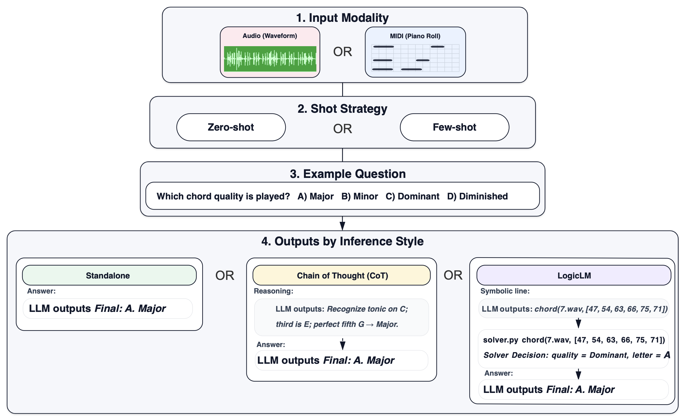

# LogicLM Stimuli

This directory contains the **LogicLM-specific stimuli** used in the MUSE Benchmark. It focuses on a subset of MUSE tasks that have a clear **symbolic / relational reasoning structure**, making them well-suited for LogicLM-style prompting and deterministic solvers.

The full MUSE Benchmark is introduced in our paper:

> **THE MUSE BENCHMARK: PROBING MUSIC PERCEPTION AND AUDITORY RELATIONAL REASONING IN AUDIO LLMs**  
> https://arxiv.org/abs/2510.19055

---

## What is the MUSE Benchmark?

The **MUSE Benchmark** is a collection of controlled, music perception tasks designed to probe how well audio-capable models capture **core aspects of human music perception**. Across tasks, we systematically vary factors such as:

- Rhythmic structure (e.g., syncopation, metrical alignment)  
- Pitch relationships (e.g., interval structure, transposition, contour)  
- Harmony and chord quality  
- Relational reasoning over short musical “mini-experiments”

Each task is framed as a **multiple-choice question** over short musical stimuli (typically audio excerpts), and is designed to have a **single correct answer** grounded in music-theoretic or perceptual principles. This enables standardized evaluation and direct comparison across different audio LLMs and prompting strategies.

---

## What is the LogicLM portion?



The **LogicLM portion** of MUSE takes a subset of these tasks—specifically those that can be cast as structured reasoning problems—and runs them through a **two-stage pipeline**:

1. **Structured symbolic description**  
   The model is first instructed to output a **strictly formatted symbolic line** (e.g., pitch lists, intervals, onset grid). This representation is designed to be:
   - Machine-parsable (no extra commentary, consistent delimiters)  
   - Close to the underlying musical structure  
   - Stable across runs for deterministic evaluation

2. **Deterministic solver + final answer**  
   A **deterministic solver** then operates on the symbolic line to compute the correct response (e.g., which option is most syncopated, whether two excerpts are transposed versions of each other, which chord quality is present). The model’s final categorical answer (A–E or Yes/No) is evaluated against the ground truth derived from the filenames and task design.

This LogicLM setup allows us to **separate errors due to perception / representation** (symbolic line quality) from errors due to **reasoning / decision** (solver outcome), and supports **self-refinement loops** when the symbolic output is malformed.


## How the LogicLM evaluation works

All LogicLM experiments followed a shared protocol:

1. **Prompting and decoding**  
   - Models are prompted to produce **only** a symbolic line in a strict schema.  
   - Decoding settings are deterministic and are held consistent across runs.

3. **Parsing and validation**  
   - The symbolic line is parsed and validated against the predefined schema.  
   - If there is a parse, structural, or domain error, a **self-refinement (SR) loop** is triggered, where the model is asked to **fix the output only** (no extra commentary) for up to a small, fixed number of SR rounds.

4. **Deterministic solver**  
   - A dedicated solver (pure Python, no randomness) computes the final answer from the symbolic representation.  
   - If the solver cannot decide (e.g., missing fields, inconsistent values), this is logged as an **undecidable** trial, and may trigger a final SR attempt depending on the task.

5. **Evaluation and logging**  
   - The solver’s output (e.g., `C`, `Yes`, `No`) is mapped to the multiple-choice label (A–E / Yes/No) and compared to the ground truth.  
   - Scripts log:
     - Model configuration, decoding settings, seeds  
     - Stimulus IDs and file paths  
     - Raw model outputs and final symbolic lines  
     - Parser/solver status and final correctness

---

## Citation

If you use the LogicLM stimuli or any part of the MUSE Benchmark in your work, please cite:

  ```
  Carone, B. J., Roman I. R., & Ripollés P. (2025). THE MUSE BENCHMARK: PROBING MUSIC PERCEPTION AND AUDITORY RELATIONAL REASONING IN AUDIO LLMS. 
  arXiv preprint arXiv:2510.19055 https://arxiv.org/abs/2510.19055
  ```
and
  ```
  Carone, B. J., Roman I. R., & Ripollés P. (2026). LLMs can read music, but struggle to hear it: An evaluation of core music perception tasks. 
  https://openreview.net/forum?id=hKE8tQzueC
  ```


For questions, please contact:  
**Brandon Carone – bcarone@nyu.edu**  
[https://brandoncarone.github.io/](https://brandoncarone.github.io/)  


